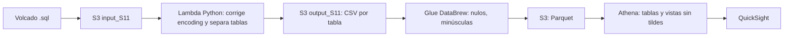
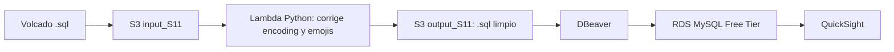

# Educameter: pipeline de limpieza y analítica de encuestas en AWS

**Caso de estudio · Prácticum 2.1 · Universidad Técnica Particular de Loja (UTPL) · Nov 2025 – Ene 2026**
Autor: Willian Alexander Jadán Urgiles · Facultad de Ingeniería y Arquitectura

> **Sobre la evidencia.** Los recursos de AWS se eliminaron al terminar el Prácticum para evitar costos, algunos scripts se rescataron. Este repositorio documenta el trabajo a partir de los informes de avance entregados a mi tutor (6 informes, fechados entre el 28/11/2025 y el 23/01/2026). Todos los datos y capturas mostrados están anonimizados o son sintéticos.

---

## Resumen

Educameter es una aplicación donde los estudiantes califican las clases de sus docentes y registran cómo se sintieron durante la sesión. La Facultad entregó un volcado `.sql` con miles de registros, con **datos nulos, espacios en blanco, emojis y errores de codificación**, que impedían analizarlo.

Diseñé e implementé dos arquitecturas en AWS para limpiar los datos y visualizarlos, y las comparé dentro de los límites de la capa gratuita:

1. **Data Lake serverless:** S3 + Lambda + Glue DataBrew + Athena + QuickSight.
2. **Base relacional administrada:** S3 + Lambda + RDS (MySQL) + DBeaver + QuickSight.

## Objetivos

- Corregir problemas de codificación y depurar nulos, espacios y caracteres especiales.
- Construir dashboards interactivos sobre desempeño docente y estado anímico estudiantil.
- Comparar un enfoque Data Lake con un enfoque RDBMS.
- Proponer mejoras de visualización en Figma.
- Operar todo dentro del Free Tier, controlando costos.

## Arquitecturas

### A. Data Lake serverless

### B. Relacional administrada

## Arquitectura propuesta

## Servicios y su rol

| Servicio | Uso en el proyecto |
|---|---|
| **S3** | Carpetas `input_S11` (volcado `.sql`) y `output_S11` (CSV, Parquet o `.sql` limpio, según la arquitectura) |
| **IAM** | Roles para que Lambda y Glue accedan a S3 de forma segura |
| **Lambda (Python)** | Corregir fallas de codificación del `.sql` y separar las tablas en archivos individuales |
| **Glue DataBrew** | Eliminar o completar nulos, pasar texto a minúsculas y convertir a Parquet |
| **Athena** | Base de datos virtual sobre Parquet, con vistas SQL que omiten tildes |
| **RDS (MySQL)** | Instancia administrada en Free Tier para la alternativa relacional |
| **DBeaver** | Ingesta de datos y validación de consultas SQL |
| **QuickSight** | Dashboards de BI |
| **Figma** | Mockups de nuevas visualizaciones e interfaz |

## Limpieza de datos

| Problema | Solución |
|---|---|
| Errores de codificación y caracteres corruptos | Script Python en Lambda sobre el `.sql` original |
| Emojis y caracteres especiales | Depuración en Lambda antes de cargar a la base |
| Nulos en comentarios y calificaciones | Eliminar filas o completar con valor personalizado; sentimientos nulos reemplazados por `0` |
| Mayúsculas inconsistentes y espacios iniciales | Conversión a minúsculas y `TRIM` |
| Comentarios vacíos (`"Sin comentarios"`) | Excluidos del análisis |
| Sentimientos guardados como `varchar` | Conversión a `int` |
| Tildes que dividían palabras iguales | Vistas en Athena que las omiten |
| Palabras vacías ("el", "las", "que"...) en la nube de palabras | Filtradas en un campo calculado |

## Visualizaciones en QuickSight

- **Nube de palabras** de comentarios, con tabla de palabras clave y acceso a todos los comentarios.
- **Sentimientos de los estudiantes** por semana, por franja del día y por materia (conteo de votos por sentimiento).
- **Rendimiento de las clases** a lo largo del periodo, por materia y por jornada (mañana/tarde).
- **Calificación de materias por docente**, con filtros por docente y materia.
- **Vista unificada:** una vista SQL que reúne a todos los docentes (materias, calificaciones, comentarios, sentimientos y fechas) para consultarlos desde una sola página de trabajo.

**Nube de palabras**

**Rendimiento | Propuesta 1**

**Rendimiento | Propuesta 2**

**Sentimientos | Propuesta 1**

**Sentimientos | Propuesta 2**

## Comparación de arquitecturas

| Criterio | Data Lake (S3 + Glue + Athena) | RDS (MySQL) |
|---|---|---|
| Modelo de costo | Pago por uso, sin servidor encendido | Instancia activa mientras exista |
| Limpieza | Visual y automatizada con DataBrew | SQL manual en DBeaver |
| Consultas | SQL sobre Parquet en S3 | SQL transaccional estándar |
| Administración | Mínima | Mayor (instancia, conexión, ingesta) |
| Mejor para | Análisis de grandes volúmenes | Datos que se consultan y actualizan con frecuencia |

## Gestión de costos

Todo el trabajo se hizo bajo el plan gratuito de AWS y con servicios de bajo costo, por lo que algunas partes se simplificaron a propósito. Al terminar, eliminé todos los recursos para evitar cobros.

## Cronología del trabajo

| Fecha | Entregable |
|---|---|
| 28/11/2025 | Investigación de servicios AWS (base de datos, análisis y almacenamiento) y 3 arquitecturas de ejemplo |
| 05/12/2025 | Propuesta con S3, DataBrew, Athena y QuickSight, más propuestas visuales en Figma |
| 19/12/2025 | Pipeline serverless completo: Lambda, DataBrew, Athena y dashboards |
| 12/01/2026 | Arquitectura alternativa con RDS y consultas SQL |
| 19/01/2026 | Limpieza SQL en RDS y dashboards actualizados por docente y materia |
| 23/01/2026 | Nube de palabras refinada y dashboard unificado de todos los docentes |

## Aprendizajes

- Diseñar y justificar una arquitectura según costo, escala y mantenimiento.
- Resolver problemas reales de calidad de datos: encoding, nulos y texto sucio.
- Trabajar con roles IAM y permisos entre servicios.
- Controlar costos y limpiar recursos en la nube.
- Documentar avances de forma técnica para un tutor externo.

## Código

*[AÑADIR: scripts reconstruidos con datos sintéticos]*

- `lambda`: corrección de codificación y separación de tablas.

      import json
      import boto3
      import ftfy
      import os
      import re  
      
      s3 = boto3.client('s3')
      
      def lambda_handler(event, context):
          # --- CONFIGURACIÓN ---
          bucket_name = 'opinion-est-crudo' 
          
          # Rutas definidas
          key_origen = 'input_S11/sabirmco_rldb13_12_2025.sql'
          key_destino = 'outputS11/sabirmco_rldb13_12_2025_limpio.sql'
          
          # Rutas temporales
          path_descarga = '/tmp/original.sql'
          path_limpio = '/tmp/limpio.sql'
          
          # Compilamos la regla de emojis una sola vez para que sea más rápido
          # Esta regla busca caracteres fuera del rango básico (0000-FFFF)
          # Esto elimina emojis pero MANTIENE las tildes y ñ.
          filtro_emojis = re.compile(r'[^\u0000-\uFFFF]') 
          
          print(f"Iniciando descarga de: {key_origen}")
          
          try:
              # 1. Descargar
              s3.download_file(bucket_name, key_origen, path_descarga)
              
              print("Descarga completada. Iniciando limpieza...")
              
              # 2. Lógica de limpieza
              with open(path_descarga, 'r', encoding='utf-8', errors='ignore') as infile, \
                   open(path_limpio, 'w', encoding='utf-8') as outfile:
                  
                  lineas_procesadas = 0
                  for line in infile:
                      # A. Arreglar codificación (Mojibake)
                      line_fixed = ftfy.fix_text(line)
                      
                      # B. Arreglar nulos específicos
                      if "values (," in line_fixed:
                          line_fixed = line_fixed.replace("values (,", "values (NULL,")
                      
                      # C. Eliminar literal "\r\n"
                      line_fixed = line_fixed.replace("\\r\\n", "") 
                      
                      # D. NUEVO: ELIMINAR EMOJIS
                      # Reemplaza cualquier caracter "astral" (emojis) por vacío
                      line_fixed = filtro_emojis.sub('', line_fixed)
      
                      outfile.write(line_fixed)
                      lineas_procesadas += 1
                      
              print(f"Limpieza finalizada. Líneas procesadas: {lineas_procesadas}")
              print(f"Subiendo archivo a: {key_destino}")
              
              # 3. Subir
              s3.upload_file(path_limpio, bucket_name, key_destino)
              
              return {
                  'statusCode': 200,
                  'body': json.dumps(f'Éxito. Archivo sin emojis guardado en {key_destino}')
              }
              
          except Exception as e:
              print(f"Error CRITICO: {str(e)}")
              return {
                  'statusCode': 500,
                  'body': json.dumps(f'Error procesando archivo: {str(e)}')
              }

- `sql/nube de palabras`: Separacion de palabras

      SELECT 
          j.palabra_limpia AS palabra,
          COUNT(*) AS frecuencia
      FROM 
          result_class, -- TU TABLA
          JSON_TABLE(
              -- 1. Truco: Convertir el texto en un Array JSON válido
              -- Reemplazamos espacios por "," para crear la estructura ["p1","p2"]
              CONCAT(
                  '["', 
                  REPLACE(
                      REPLACE(REPLACE(LOWER(senti1), '"', ''), '.', ''), -- Limpieza básica de signos
                      ' ', 
                      '","'
                  ), 
                  '"]'
              ),
              -- 2. Extraer cada elemento del array como una fila
              "\([*]" COLUMNS (palabra_limpia VARCHAR(255) PATH "\)")
          ) AS j
      WHERE 
          LENGTH(j.palabra_limpia) > 2 -- Filtra palabras de 1 o 2 letras (y, o, el, la...)
          AND j.palabra_limpia NOT IN (
              -- 3. TU LISTA NEGRA (Personalízala aquí)
              'los', 'las', 'una', 'unos', 'unas',
              'para', 'como', 'pero', 'por', 'sus', 
              'que', 'del', 'con', 'este', 'esta',
              'todo', 'toda', 'mas', 'muy', 'sin', 
              'sobre', 'cuando', 'estos', 'estas'
          )
      GROUP BY j.palabra_limpia
      ORDER BY frecuencia DESC
      LIMIT 100;

> Reconstrucción basada en el diseño original, con datos ficticios.

## Documentación original

[Informes de avance del Prácticum 2.1](https://github.com/wajadan/AWS-Educameter-ETL/tree/767098a4d368f99a6061c74a5540872e66c8034f/docs/informes)

[Propuestas de visualización](https://github.com/wajadan/AWS-Educameter-ETL/tree/767098a4d368f99a6061c74a5540872e66c8034f/docs/img)
